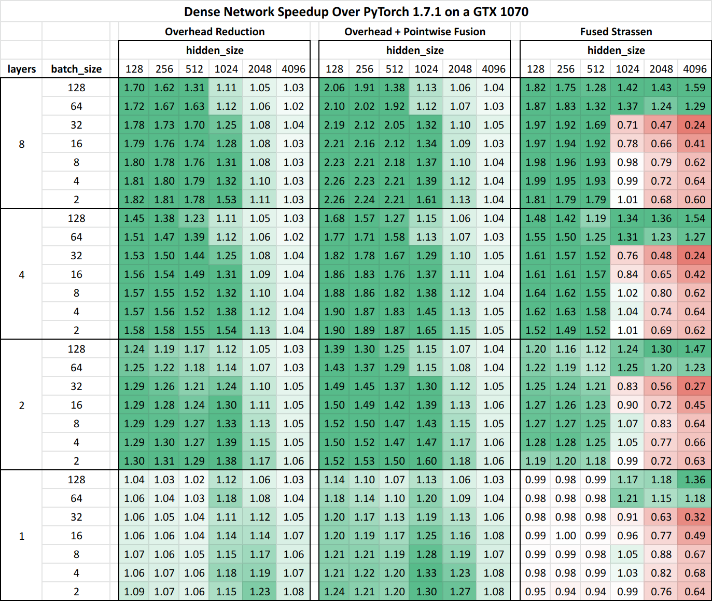

# GPU Overheads and Fused Strassen

I shared a version of these results with PyTorch developers inside Facebook in December, but I wanted to repost it to [dev-discuss] now that we have this new forum for this type of content.  [Chillee] already posted a [followup] to the internal version of this post that found: 1) TorchScript closes a lot of the overhead related performance gap, 2) `nn.Module` is to blame for much of the overheads, and 3) PyTorch 0.4 had lower overheads.

This post is exploring GPU overheads, pointwise fusion, and an asymmetric fused Strassen algorithm.  I show almost 2x speedups from overhead reduction, up to 1.24x speedups from bias/ReLU fusion, and show that a single layer of Strassen is up to a 1.53x win for batch_size>=64 and hidden_size>=1024.

[followup]: https://dev-discuss.pytorch.org/t/overhead-in-nn-module-causing-massive-slowdowns-compared-to-raw-cublas-or-torchscript/110
[dev-discuss]: https://dev-discuss.pytorch.org/
[Chillee]: https://dev-discuss.pytorch.org/u/Chillee

## The benchmark and measurement setup

This post measures GPU inference a textbook dense network defined by:

```
from torch.nn import Linear, ReLU, Sequential
model = []
for _ in range(num_layers):
    model.append(Linear(hidden_size, hidden_size))
    model.append(ReLU(inplace=True))
model = Sequential(*model)
```

I measure with `torch.no_grad()` enabled running GPU inference on an NVIDIA GTX 1070. I ran each test 5000 times and report the median to reduce noise and show relative performance to PyTorch 1.7.1, where 1.0x is matching the speed of PyTorch and higher is better.

## Overhead reduction and codegen

Prior results on CPU have shown huge speedups on small models through overhead reduction. I expected overhead to be less of an issue on GPU because it is possible to overlap host overheads with device compute. It turns out I was wrong. Overhead is an even bigger problem on GPU!

To estimate possible speedups from overhead reduction, I reimplemented this model using [PyCUDA]. I preallocated the GPU buffers and implemented each layer as 3 CUDA kernels:
- `cublasSgemm()` (PyTorch also uses cuBLAS)
- A naive CUDA kernel to add bias in-place
- A naive CUDA kernel to run ReLU in-place

The [code is here] and [results are here]. The speedups are pretty huge. It is faster in all cases and 1.8x faster in the best case. On the 8-layer network there is a bit of a divide at hidden_size 1024. Below 1024 the average speedup is 1.73x, while above 1024 the average speedup is 1.05x.

Even though we have seen huge overheads problems before, these results are still surprising to me. I am driving the GPU from unoptimized Python, so it shouldn't be possible to get such a big speedup this way. The speedups from this naive rewrite are bigger than the speedups in the remainder of this post. This is theoretically achievable in eager mode with a memory allocator that does dynamic buffer reuse.

[PyCUDA]: https://documen.tician.de/pycuda/
[code is here]: https://github.com/jansel/fused-strassen-experiment/blob/main/gpu_overhead.py
[results are here]: https://docs.google.com/spreadsheets/d/1eI5MpC3f4ETmueTwz4BiAlb5bVjf6MollI9McpCXjS8/edit?usp=sharing

## Pointwise fusion

Next up, I tried combining the bias and ReLU into a single kernel. This is just a [one line change] to the previous code. Again, [results are here].

On CPU this yielded tiny single-digit speedups, but on GPU this helps a lot more. The incremental speedup is up to 1.14x on 1-layer and up to 1.24x on 8-layers. Similar to overhead reduction, on the 8-layer network there is a bit of a divide at hidden_size=1024. Below 1024 the average incremental speedup is 1.22x, while above 1024 the average incremental speedup is only 1.01x. Combining the speedups here with overhead reduction we are now well over a 2x average speedup over PyTorch for smaller sizes below 1024 on the 8-layer network.

[one line change]: https://github.com/jansel/fused-strassen-experiment/blob/main/gpu_overhead.py#L41

## Asymmetric Fused Strassen

For the final experiment implemented a fused version of [Strassen algorithm] implemented in Python+PyCUDA. This algorithm uses an asymmetric fusion where I combine parts of the matrix multiple from one layer with parts of the matrix multiply from the next layer.

For a 4-layer network there will be 9 CUDA kernels:
- layer-1 Strassen prefix (pointwise)
- layer-1 `cublasSgemmBatched()` (sizes `7 x [(batch_size/2) x (hidden_size/2) x (hidden_size/2)]`)
- Pointwise fusion: layer-1 Strassen suffix, layer-1 bias/activation, layer-2 Strassen prefix
- layer-2 `cublasSgemmBatched()`
- Pointwise fusion: layer-2 Strassen suffix, layer-2 bias/activation, layer-3 Strassen prefix
- layer-3 `cublasSgemmBatched()`
- Pointwise fusion: layer-3 Strassen suffix, layer-3 bias/activation, layer-4 Strassen prefix
- layer-4 `cublasSgemmBatched()`
- Pointwise fusion: layer-4 Strassen suffix, layer-4 bias/activation

The data transferred between the CUDA kernels is shape `[7, batch_size/2, hidden_size/2]` representing the 7 intermediate buffers used by Strassen's algorithm. This requires some preprocessing to pre-format the weight tensors in this format. This code doesn't require any fancy codegen (just pointwise), though would rely rather heavily on graph-level transformations to do the asymmetric fusion of the matrix multiply.  This code requires an even batch size and hidden size, but could be extended to support odd numbers.

See the [asymmetric fused Strassen code] and again the [results are here]. Compared to PyTorch, fused Strassen is faster most of the time -- however for the smaller sizes this is all due to overhead reduction. If you compare to the pointwise fusion above, fused Strassen is an increment improvement only when `batch_size>=64` and `hidden_size>=1024`. The speedup is large, for those sizes an average of 1.3x on the 8-layer network and up to 1.53x. It should also be possible to extend this to training by having the fused kernels have secondary outputs to be used in the backwards pass.

[Strassen algorithm]: https://en.wikipedia.org/wiki/Strassen_algorithm
[asymmetric fused Strassen code]: https://github.com/jansel/fused-strassen-experiment/blob/main/gpu_strassen.py


[inline caching]: https://en.wikipedia.org/wiki/Inline_caching
[Part 4: Asymmetry]: https://fb.workplace.com/groups/800295973786609/permalink/1028082077674663/

## Results



[Share your comments here](https://dev-discuss.pytorch.org/t/gpu-overheads-and-fused-strassen/143)
